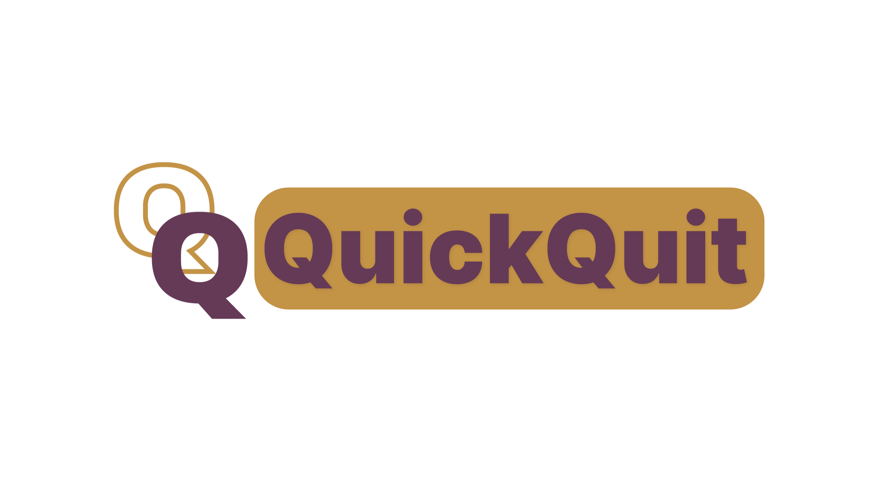

# CSE Capstone Project - *QuickQuit*



Welcome to the CSE Capstone Project for *QuickQuit*! This repository serves as the foundation for developing an innovative browser extension aimed at enhancing user safety and convenience.

---

## 🚀 Project Overview
*QuickQuit* is a browser extension designed to empower users by providing a quick exit tool for certain situations. It achieves this by:
- Reacting to HTTPS requests from a remote site.
- Modifying the user's browsing history to facilitate efficient task-switching or exit actions.

The extension's mission aligns with creating a safer, more user-centric browsing experience.

---

## 📂 Project Structure

### **Tech Stack**
This project utilizes the following technologies for development:

- **JavaScript**: Core functionality and extension scripting.
- **HTML/CSS**: Structuring and styling the extension UI and related web components.
- **Bash**: Scripts for automating development tasks and deployment processes.

---

## ✨ Features & Capabilities

- **Quick Exit**: Instantly redirects users to a predefined "safe" site.
- **Browsing History Management**: Deletes or modifies history entries to preserve user privacy.
- **Responsive Design**: Ensures the extension UI works seamlessly across various devices.

---

## 🛠️ Development Considerations

### **Pre-Development Requirements**
- **Secure Communication**: Ensure all interactions are via HTTPS.
- **Validation**: Implement strict validation for all user actions to prevent misuse.
- **Performance Optimization**: Prioritize efficiency for a smooth user experience.

---

## 🏁 Getting Started

1. Clone the repository:
   ```bash
   git clone https://github.com/fsevkli/QuickQuit.git
   ```

2. Navigate to the project directory:
   ```bash
   cd QuickQuit
   ```

3. Run the extension in development mode:
   - Load the extension into your browser:
     - Open your browser's extensions page (e.g., `chrome://extensions/`).
     - Enable "Developer Mode."
     - Click "Load Unpacked" and select the extension folder.

---

## 🎨 Design Principles

### **Website Design**
A clean, user-friendly design aligned with the project’s mission:

1. **Color Palette**:
   - **Primary Color**: Purple (to represent domestic violence awareness).
   - **Complementary Colors**: Harmonized tones for a visually appealing design.  
     View the full palette and fonts [here](https://www.realtimecolors.com/?colors=22021b-fffbf5-643a55-91a385-c39346&fonts=Inter-Inter).

2. **Typography**:
   - Readability-first with clear, consistent headings and body text.

3. **Responsive Design**:
   - Fully adaptable UI for various devices.

4. **Brochure Design**:
   - Maintains visual consistency with the website and extension.  
     Preview the brochure on [Canva](https://www.canva.com/design/DAGbzFq34lw/QMtO1t_80gh-UQH1swiK3A/edit?utm_content=DAGbzFq34lw&utm_campaign=designshare&utm_medium=link2&utm_source=sharebutton).

---

## 🔗 Key Links

- **Color Palette & Fonts**: [Realtime Colors](https://www.realtimecolors.com/?colors=24021c-fffbf6-BC67CB-F5B8C8-9533EB&fonts=Inter-Inter)  
- **Brochure Draft**: [Canva](https://www.canva.com/design/DAGbzFq34lw/QMtO1t_80gh-UQH1swiK3A/edit?utm_content=DAGbzFq34lw&utm_campaign=designshare&utm_medium=link2&utm_source=sharebutton)


---

## 📝 License
This project is licensed under the [MIT License](LICENSE).

---

## 🤝 Contributors
- **Team Name**: Quick Quit Team
- **Members**: Claire, Gunnar, Nathan, Neela, Ryan, Xyann, Yusuf, Zach

---

Thank you for supporting *QuickQuit*! If you have any questions, suggestions, or feedback, feel free to open an issue or reach out to us at [info@quickquit.app](mailto:info@quickquit.app).
